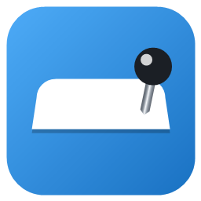

# Tabkeeper

Tabkeeper gives each Git branch its own set of pinned editor tabs. Switch branches and your pinned
tabs switch with you: the tabs pinned on the branch you leave are saved, and the ones saved for the
branch you arrive on are opened and pinned. Tabkeeper only changes which tabs are pinned. It never
opens, closes, or saves files beyond that, and never touches file contents.

This repository holds two independent implementations of the same idea, one per editor:

| Platform | Directory | README |
| --- | --- | --- |
| Visual Studio 2022 / 2026 | [`visualstudio/`](visualstudio) | [visualstudio/README.md](visualstudio/README.md) |
| VS Code / VSCodium | [`vscode/`](vscode) | [vscode/README.md](vscode/README.md) |

They're separate codebases (different platform, different extension API, different packaging)
built independently against each editor's own extension model, not a shared core. See each
subdirectory's own README for install and usage instructions specific to that editor.
